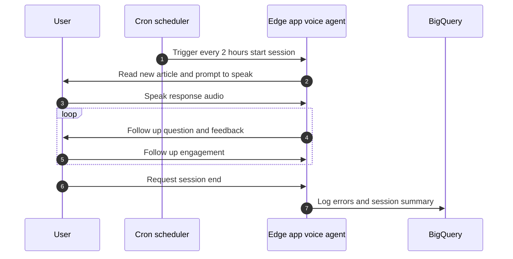
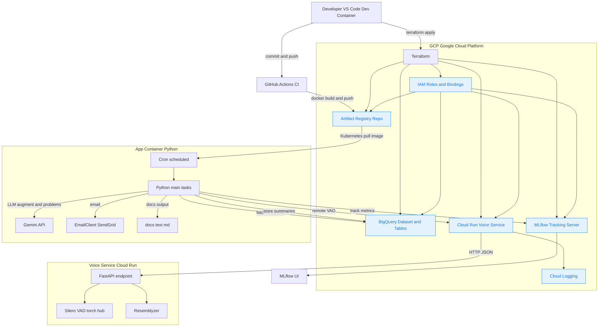

# blabin

An adaptive French-learning agent designed to help improve faster. Blabin tailors content to your interests and focuses on the errors you actually make, creating a more targeted and meaningful learning experience.

## Introduction

Having learned French with apps like Busuu and Duolingo over the past four years, I found it difficult to stay engaged with traditional apps beyond the B1 stage. Many tools treat every learner identically, giving equal weight to grammar, gender, vocabulary, and comprehension, regardless of your strengths or weaknesses.

For me, some aspects of the language (like vocabulary) come naturally, while others (like grammatical gender) are harder to master. These apps repeatedly drill what I already know, while letting weak spots slide. They also rarely offer content that’s engaging or personally relevant.

Blabin addresses these issues by:

- Pulling topical, real-world subjects (via Tavily search and Radio-Canada articles)

- Tracking user errors in real time

- Adapting future prompts based on what you actually struggle with

## Interface

Blabin is designed to run on a small edge device (like raspberry pi). A cron job triggers every two hours and reads aloud a new Radio-Canada article for the user to discuss. If the user engages, the conversation continues until they end the session. At that point, Blabin tabulates errors, computes a level estimate, and logs the results to BigQuery.


## Design

The diagram shows a simple flow from development to runtime: GitHub Actions builds the voice service and the Python app images and pushes them to Artifact Registry in Google Cloud, while Terraform provisions the cloud side resources such as Artifact Registry, Cloud Run for the voice API, BigQuery, IAM, MLflow tracking, and Cloud Logging. At the edge, the Python app container is pulled from Artifact Registry and runs scheduled tasks via cron to fetch mistakes from BigQuery and track metrics to MLflow, while the user can speak to the voice agent; the edge app streams audio frames to the Cloud Run voice service over HTTP for VAD and embeddings and uses the responses to drive the interaction.



## Prerequisites
- Use the dev container for this workspace (gcloud CLI is preinstalled).
- A Google Cloud project with billing enabled
- BigQuery API enabled in the project
- Google Cloud Text-to-Speech API enabled
- Google Cloud Speech-to-Text API enabled
- Tavily account and API key (for topical web search tools)

## Authenticate to Google Cloud
```sh
gcloud init             # set up CLI and choose your project
gcloud auth application-default login
gcloud config set project <YOUR_GCP_PROJECT_ID>
```

## Enable Speech APIs (required for TTS/STT)
```sh
# Enable Text-to-Speech and Speech-to-Text in your project
gcloud services enable texttospeech.googleapis.com speech.googleapis.com
```

## Create a Gemini API key
```sh
"$BROWSER" https://aistudio.google.com/app/apikey
```
Copy the key; you will add it to `.env` below.

## Tavily web search (topical tools)
The agent can answer topical questions using Tavily search and URL fetching.
1) Create a Tavily account and get an API key:
   ```sh
   "$BROWSER" https://tavily.com
   ```
2) Add the key to your environment (see .env section below).
The key powers the `search_web` and `fetch_url` tools. Without it, those tools are disabled.

## Create a SendGrid Account
Sendgrid is a transactional email service that lets you create and send emails with a RESTful API. This email is used to send practice exercises to the students.
1) Create a free account in SendGrid
2) Verify a single sender identity with email address of your choice
3) Ensure API key has mail send permissions
4) Update .env with variables:
```sh
SENDGRID_API_KEY=SG.xxxxx
SENDER_EMAIL=<your_verified_single_sender@example.com>
```

## Service Account Credentials (Non‑Interactive Auth)

Create a dedicated service account so the app and MLflow proxy can access GCP APIs without manual gcloud login.

1. Choose roles (minimum):
   - BigQuery: roles/bigquery.user
   - Cloud Run (if proxying MLflow): roles/run.viewer roles/run.invoker
   - (If MLflow artifacts in GCS): roles/storage.objectViewer
   Add more only if required.

2. Create the service account and key (run on host shell):
```sh
SA_NAME=blabin-app
PROJECT_ID=<YOUR_GCP_PROJECT_ID>

gcloud iam service-accounts create $SA_NAME \
  --display-name "Blabin Application" \
  --project $PROJECT_ID

for role in roles/bigquery.user roles/run.viewer roles/run.invoker roles/storage.objectViewer; do
  gcloud projects add-iam-policy-binding $PROJECT_ID \
    --member="serviceAccount:${SA_NAME}@${PROJECT_ID}.iam.gserviceaccount.com" \
    --role="$role"
done

mkdir -p .creds
gcloud iam service-accounts keys create .creds/gcp-sa-key.json \
  --iam-account "${SA_NAME}@${PROJECT_ID}.iam.gserviceaccount.com" \
  --project $PROJECT_ID

## IMPORTANT: GRANT DATA OWNERSHIP TO SERVICE ACCOUNT
gcloud projects add-iam-policy-binding "$PROJECT_ID" \
  --member="serviceAccount:$SA_EMAIL" \
  --role="roles/bigquery.dataOwner"
```

## Infrastructure (Terraform)
Set up cloud resources using the READMEs in the terraform folders:
- Environment resources (BigQuery, etc.): see platform/README.md
- MLflow tracking server (Cloud Run + Cloud SQL + GCS): see services/mlflow/README.md

Those guides cover creating tfvars from templates, enabling services, building/pushing the MLflow Docker image, and applying Terraform.

## Create your .env file
Create `.env` at the repo root with:
```sh
# .env
# owner of GCP account
OWNER_EMAIL=<YOUR_EMAIL>

# api key from gemini
GEMINI_API_KEY=<YOUR_GEMINI_API_KEY>

# Environment Configuration
ENVIRONMENT=dev

# GCP Configuration
BIGQUERY_DATASET=dev_blabin
BIGQUERY_LOCATION=US
GOOGLE_CLOUD_PROJECT=<GOOGLE_CLOUD_PROJECT>
GOOGLE_CLOUD_QUOTA_PROJECT=<GOOGLE_CLOUD_PROJECT>
GOOGLE_APPLICATION_CREDENTIALS=./.creds/gcp-sa-key.json

# settings for mlflow
MLFLOW_URI=https://some-mlflow.a.run.app
MLFLOW_EXPERIMENT=blabin-development

# tavily search config
TAVILY_API_KEY=<TAVILY_API_KEY>

# config for sending emails with practice questions
SENDGRID_API_KEY=<SENDGRID_API_KEY>
SENDGRID_EMAIL=<SENDGRID_EMAIL>
```


## Run the application (chat mode)
```sh
python -m src.main --chat
```

## Notes
- If you see BigQuery permission errors, ensure ADC is set and the selected project matches your `.env` (GOOGLE_CLOUD_PROJECT).

## macOS audio (PulseAudio bridge)
For container audio output on macOS:
```sh
# Install PulseAudio
brew install pulseaudio

# Start (TCP accessible) daemon
pulseaudio --kill || true
pulseaudio -D --exit-idle-time=-1 \
  --load="module-native-protocol-tcp listen=0.0.0.0 port=4713 auth-anonymous=1"

# Verify it is running
ps aux | grep pulseaudio | grep -v grep
lsof -iTCP:4713 -sTCP:LISTEN
